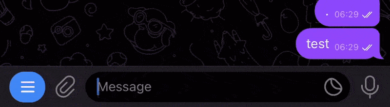

<h1 align="center">
<a href="https://t.me/sedbot">SedBot for Telegram</a>
</h1>

<p align="center">
<a href="https://www.gnu.org/licenses/gpl-3.0.en.html"></a>
<a href="https://python-telegram-bot.org/"></a>
<a href="https://casungo.top"></a>
<a href="https://python.org"></a>
</p>

<p align="center">


</p>

## 🤖 About

SedBot is a powerful Telegram bot that brings the Unix `sed` command's text transformation capabilities to your chats. It allows you to perform regex-based search and replace operations on messages, making it perfect for quick text corrections and transformations.



## ✨ Features

- 🔄 Replace text using regular expressions
- 🎯 Support for global and case-insensitive replacements
- 📝 Multiple replacement flags (g, i, m)
- 💬 Works in both private chats and groups
- 🚀 Fast and reliable performance

## 🛠️ Installation

1. Clone this repository:

```bash
git clone https://github.com/casungo/sedbot.git
```

```bash
cd sedbot
```

2. Install dependencies:

```bash
pip install -r requirements.txt
```

3. Set up your bot:

   - Get a token from [@BotFather](https://t.me/botfather)
   - Rename `.env.sample` to `.env`
   - Add your bot token to `.env`

4. Start the bot:

```bash
python main.py
```


## ☁️ Deploy on Cloudflare Workers

This repository now includes a Cloudflare Worker version of the bot in `worker.js`.

1. Install dependencies:

```bash
npm install
```

2. Set worker secrets:

```bash
wrangler secret put TELEGRAM_BOT_TOKEN
wrangler secret put TELEGRAM_WEBHOOK_SECRET
```

3. Deploy:

```bash
npm run deploy  # uses wrangler.toml explicitly
```

4. Configure Telegram webhook (replace placeholders):

```bash
curl -X POST "https://api.telegram.org/bot<TELEGRAM_BOT_TOKEN>/setWebhook" \
  -d "url=https://<your-worker>.workers.dev" \
  -d "secret_token=<TELEGRAM_WEBHOOK_SECRET>" \
  -d 'allowed_updates=["message","guest_message"]'
```

After deployment, the worker handles `/start` and `s/pattern/replacement/flags` commands from Telegram updates sent via webhook.

If you are deploying from Cloudflare Pages CI, ensure the project type is **Workers** (not Pages static assets) and run `pnpx wrangler deploy --config wrangler.toml`.

Guest Mode (Bot API 10.0) is also supported: if enabled in BotFather, the worker processes `guest_message` updates and replies using `answerGuestQuery`.

To verify Guest Mode is enabled, call `getMe` and check that `supports_guest_queries` is `true`.

Guest updates are stateless: the bot only receives the message that mentioned it and optional replied context, not full chat history or member lists.

## 📖 Usage

Reply to any message with a sed-style command:

```
s/pattern/replacement/flags
```

Flags:

- `g` - Replace all occurrences (global)
- `i` - Case-insensitive matching
- `m` - Multiline matching

Examples:

- `s/cat/dog/g` - Replace all instances of "cat" with "dog"
- `s/ERROR/error/i` - Replace "ERROR" with "error" (case-insensitive)
- `s/old//` - Remove the first occurrence of "old"

## 📄 License

This project is licensed under the [GPL v3](https://www.gnu.org/licenses/gpl-3.0.en.html) License.
